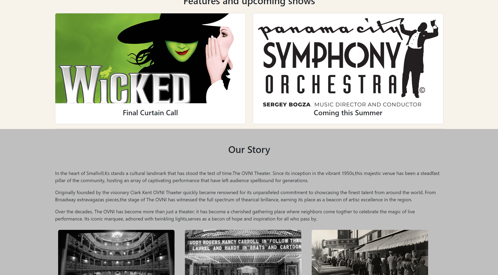
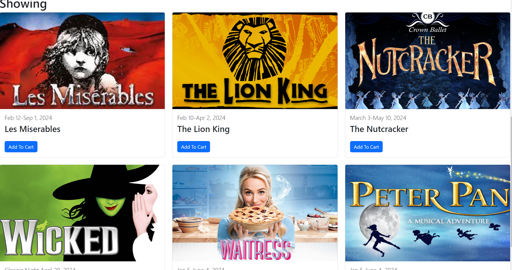
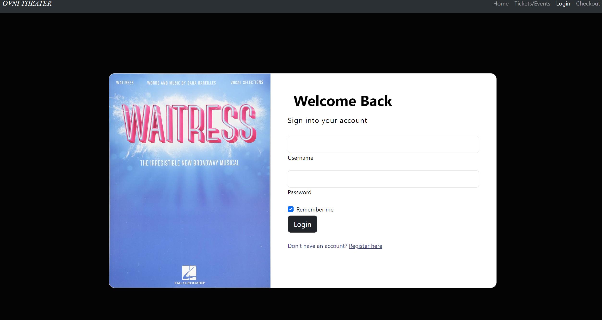
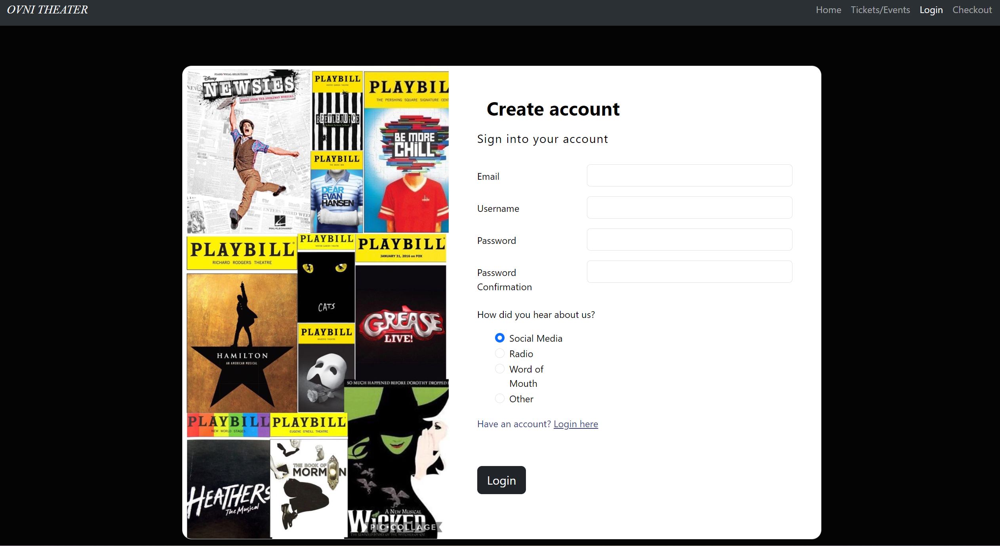
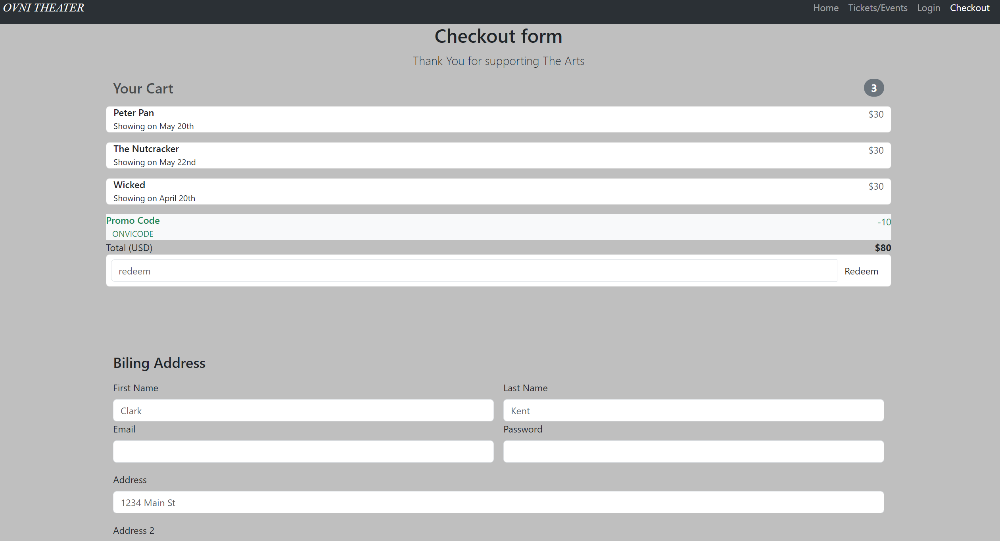
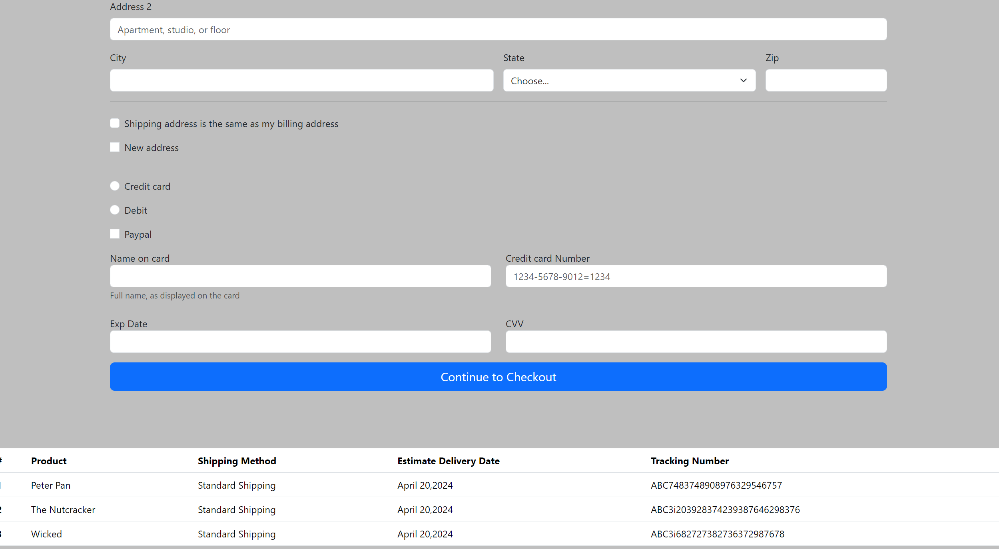

# capstone1

This is an E-commerce website that sells tickets contains schedules and gives a breif story about the theater.

It includes the Home page, Tickets/Events,Checkout,Login and User registration page.

The index.html page consistent of 
*Navbar that stretches throughout all the pages. 
*carousel which it includes three images.
*Two cards which include one image each with a title at the bottom.
*I put a break between the card and our story and a background color
*The story gives a short description of the theater.
*Below the story I included three images with margins on the right and left.
*Underneath the story I add a break and changed the color to white.
* At the bottom of the page I add an image of the seating.

The product_services page consistent of
*Hero image
*Title that says showing
*Underneath the title I have six cards with each with there own image.
*I have each row with equal spacing and equal height using CSS 
*It includes a title for each image which, includes the dates for a showing.
*I have a card title for each for each card with the products name.
*Included a button with each card that links to the checkout page.

Login page consist of 
*Consist of a nav bar
*Added a card with a background color added.
*Added an image inside the card using columns and rows to shift to the left.
*On the right side of the card added a form that consist of a username and password.
*Underneath the form added a remember me check box that I got through Bootstrap.
*Added a login button.
*Added a register here link that links to user registartion page.

User registration page consist of 
*The same form from the login page.
*Changed the image and kept the same background color to have a cohesive look.
*The form includes email, username, password and password confirmation.
*Add a question using Paragraph underneath the Paragraph added a radio form.
*Added a link that links to the home page.
*Added a login button.

Checkout Page consist of 
*Forms for your cart order
*With each list having a prefilled product name such as Peter Pan, The Nutcracker and Wicked.
*Added a promocode and a total.
*And added a break underneath your cart form.
*Gave a margin space following your cart form.
*Added a Billing Address form with the same format from your cart page except for changing the column spaces.
*The Billing Address consist of first name, last name, email, password, and address.
*Added a city, state and zip. With the state having the a drop down.
*Added a break to seperate the billing from the checkbox button. That consist of shipping addresses.
*Added a break underneath the shipping addresses to add radio button for payment type.
*Added a Name of card and Credit card number field. And Exp Date and CVV field as well.
*Added button to Continue to Checkout
*Added a table with Produc, Shipping Method, Estimated Delivery Date and Tracking Number information.

